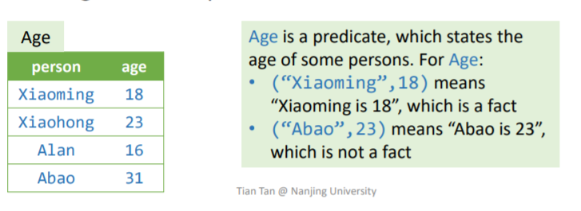
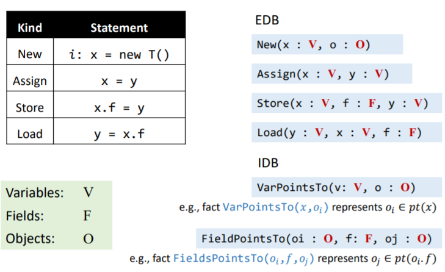
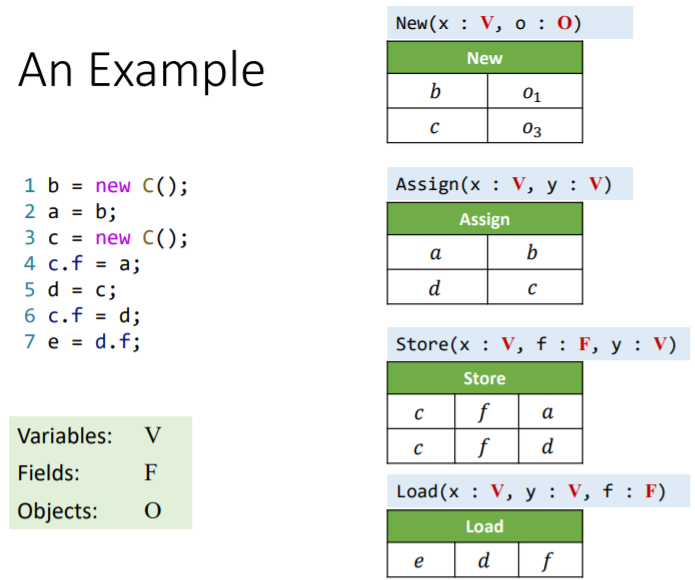
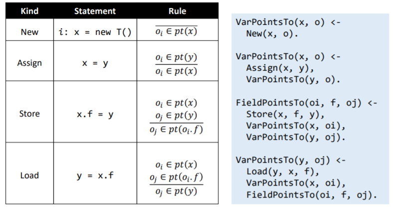
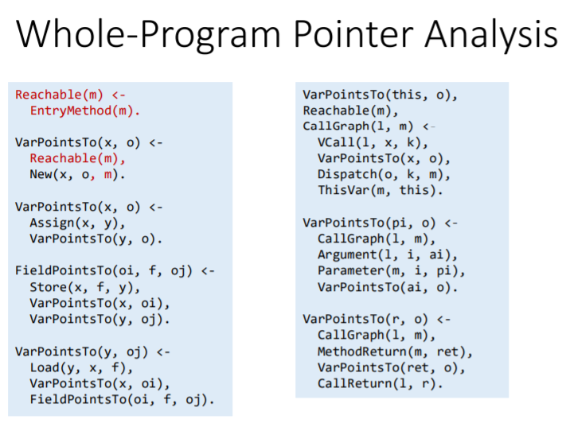
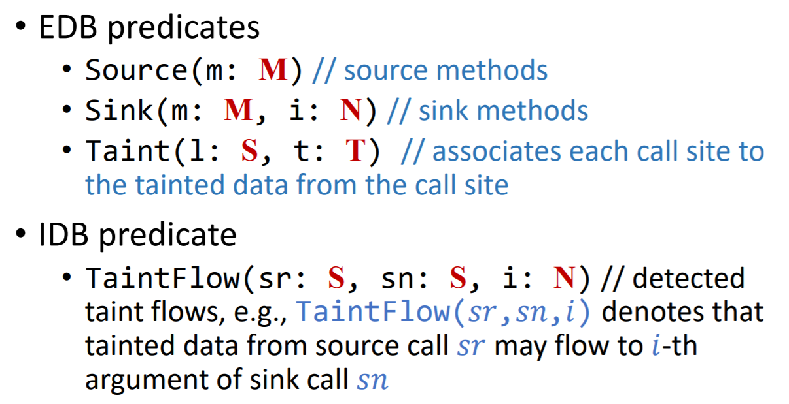
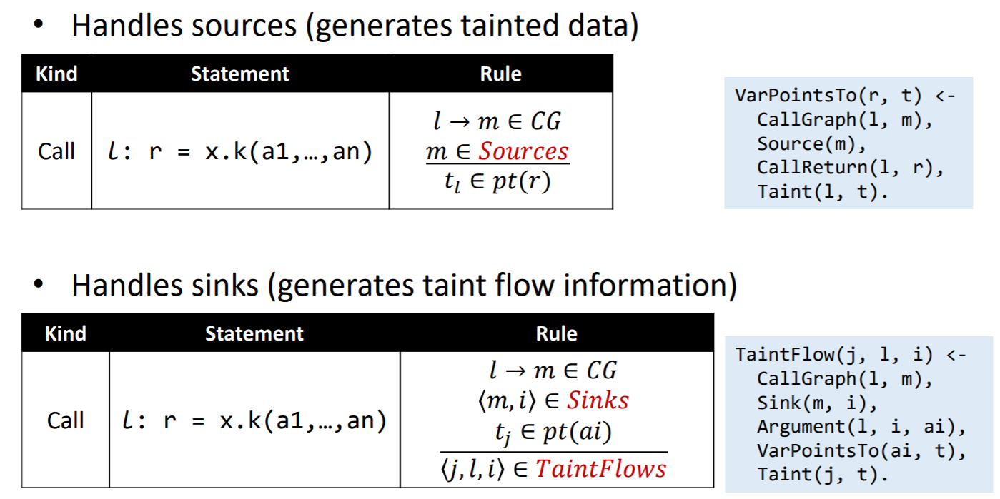

# Datalog

## Motivation

程序语言有命令式和声明式，在命令式的程序语言中，需要关心算法实现中有关数据结构的任何细节，包括数据结构的选取，数据在不同结构中的转移方式等等。

而声明式的程序语言只需要描述要做什么，例如 SQL 语句那样。而 Datalog 就是一种声明式语言，用它可以在短短二十多行之内完成指针分析

## Introduction to Datalog

Datalog 是一种声明式语言，最初用于数据库，而后来也被用来做程序分析、大数据等。

所谓 Datalog 就是 Data + Logic 的结合。它是 Prolog 语言的子集，且没有副作用、控制流、函数等概念，并且不是图灵完备的。

### 概念

* Predicates，即一个表

* Fact 是一个元组，用以表示 predicates 中的表项。

    

* Atom 可以用以代表 predicates。它的形式是 `P(X1,X2...,Xn)`

    * 其中 P 是 predicate，X 是 Arguments(terms)，可以是可表示任意值的变量或者常量

* 若 atom `P(X1,X2,...,Xn)` 中 P 确实有一个表项 `(X1,X2,...,Xn)`，那么该 atom 就是 true 的。

* Rule 用以表达逻辑关系，它的形式是 `H <- B1, ..., Bn.`

    * 其中 **H** 是 head，**B** 是 body，类型都是 atom。rule 的意思是，H 为真仅当 B 为真
    * 逗号的含义是「与」符号，所以 Bi 都是真才能让 H 为真

* 通过将 facts 和 rules 结合起来，就可以得到一个新的表。Datalog program = Facts + Rules


### Data 的来源

那么最初的 data 是从哪来的呢？

* EDB - extensional database
    * 通过外部输入来初始化，不可改变
* IDB - intentional database
    * 通过 rules 来集成的 predicates
* `H <- B1, B2, ..., Bn.`
    * H 是 IDB
    * B 可以是 IDB 或者 EDB


### 逻辑的表示

* 与，即逗号。`H <- B(X), B(Y).`
* 或，用`;`来表示。分号的优先级是小于逗号的。`H <- B(X); B(Y), B(Z).`
* 非，感叹号。`H <- !B(X), B(Y).`


### 递归

* datalog 支持递归的规则。

    

* 如果不支持递归，那么功能就仅限 select from where 型的语句了。


### 规则安全

* `A(x) <- B(y), x > y.` 这个规则对任意足够大的 `x` 都适用，没有一个上界，因此这个规则是不安全的。
* `A(x) <- B(y), !C(x,y).` 同样的，会有无穷的 `x` 满足 `!C(x, y)`，因此也是规则不安全的。

这两种规则要求 datalog 规则中，任意变量需要至少出现在一个**未取反**的**关系型** atom 里面。即，我们需要借助 predicate 来限定产生的范围。类似`A(y) <- A(x), y == x + 1` 这种可能会导致无穷生成的规则就不会出现。


* `A(x) <- B(x), !A(x).` 这个规则会产生悖论。

因此，datalog 里面不会允许**递归和取反**同时出现在**同一个 atom** 上。


### Datalog 程序的执行

* 将 EDB 和 Rules 输入到 datalog engine 里面，就会得到一套 IDB。
* 因为 facts 是不变的，可以保证 datalog 的单调性。
* datalog 必然会停机，因为
    * datalog 是单调的
    * 通过规则安全，IDB 的可能值是有限的


## Pointer Analysis via Datalog

在 datalog 中，PTA 有如下 EDB 和 IDB：



对一段程序进行分析，可以得到对应的 EDB：



然后根据基础 rules 得到 datalog rules：



再加上和 call 相关的规则，完整的 datalog rules 就是：




## Taint Analysis via Datalog

同 PTA 一样，TA 也是需要用户自定义一些 EDB，也就是 Source 和 Sink。然而这还不够，PTA 通过 New EDB 来指明 abstract object 的来源，TA 同样需要一种方法来定义 taint object 的来源。因此我们还需要追加一个 Taint EDB，来为每一个 call site 准备一个对应的 taint object。




然后根据 TA 的规则定义 datalog rules：




这是我写的 Datalog 规则，你可以参考：

```
EDB:
    Source(m)
    Sink(m, i)
    Taint(l, t)
IDB:
    TaintFlow(sr, sn, i)

----------------------------------

VarPointsTo(r, t) <-
    CallGraph(l, m),
    CallReturn(r, l),
    Source(m),
    Taint(l, t)

TaintFlow(j, l, i) <-
    CallGraph(l, m),
    Argument(l, i, ai),
    Sink(m, i),
    VarPointsTo(ai, t),
    Taint(j, t).
```


## 总结与划重点

Datalog 相比于一般的程序存在以下优缺点：

* 优点
    * 简洁易懂
    * 实现简单
    * Engine 帮你做优化
* 缺点
    * 表达能力受限，不能表达出所有的逻辑
    * 用户不能完整地控制性能，性能瓶颈可能发生在 engine 上，rules 上无法进一步优化。


### 重点

* Datalog 语言
* 如何用 Datalog 实现 PTA 和 TA
    * 2021 考点：使用 Datalog 语言，编写到达定值一个 must analysis 的形式。EDB 和 IDB 是提供给你的，你只需要编写 rules。 
